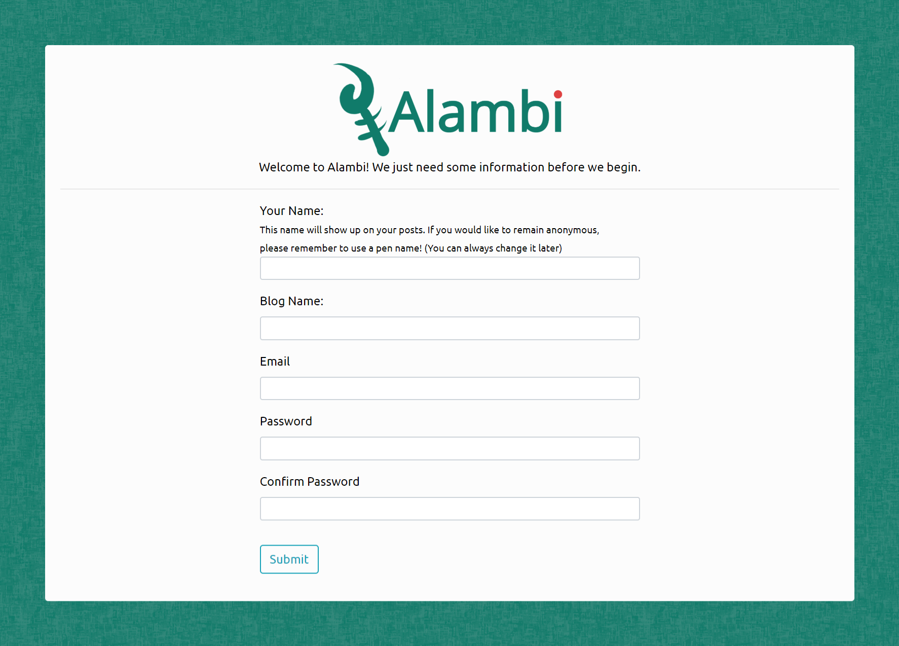

<p align="center">
  
</p>

Alambi is a blogging engine made with the Python micro-framework Flask. The motivation behind this project was to create a simple to implement blogging engine for those who need a fast and elegant solution, while also allowing for complete customization and integration into an already established web application. There is absolutely no coding necessary (although encouraged) as Alambi works fresh out of the box.

**Project Site** [alambi-blog.com](http://www.alambi-blog.com)

## Demo


## Table of Contents
* [Features](#features)
* [Getting Started](#getting-started)
* [Easy Deployment with Python Anywhere](#deploy)
* [Acknowledgements](#thanks)
* [Authors](#contact)
* [License](#license)

## <a name="features"></a> Features 
* Based on Twitter Bootstrap
* SQLAlchemy Database for storing all content
* No coding necessary setup
* Comments and Likes (Sharing coming soon!)
* Category and Tagging system
* Search functionality
* Sticky Posts
* 8 premade themes based on the color palettes of my favorite pokemon
* Extensive theme builder for custom colors and fonts
* Easily change the layout and customize the sidebar
* WYSIWYG Text editor (Powered by TinyMCE)
* Spam Protection (Powered by Google reCaptcha)

## <a name="getting-started"></a> Getting Started
### 1. Clone the Repository
In order to get alambi up and running on your local machine, either clone the repository to your desired path, or download the .zip file [here](https://www.my-alambi.com/download).

```
git clone https://github.com/domdit/alambi.git your/desired/path/alambi
```

### 2. Install Dependencies
Once you have have alambi on your machine, navigate to its directory, (set up a virtual environment), and install the dependencies by running:

on macOS and Linux:
```
pip install -r requirements.txt
```
on Windows:
```
python -m pip install -r requirements.txt
```

### 3. Configure Environment Variables
Configure necessary environment variables by editing your bashrc file `nano ~/.bashrc`. I must stress the importance of typing these environment variables in. Copying and pasting may lead to unwanted spaces or indentation that would cause the app not to run properly!

### Secret Key
You need to set a secret key for this Flask app as well as set the SQLAlchemy Database URI. The Database URI should match what is written below, while the secret key can be anything you want. Go [here](https://stackoverflow.com/questions/34902378/where-do-i-get-a-secret-key-for-flask/34903502) for more info on secret keys and Flask

```
export SECRET_KEY="your_secret_key"
export SQLALCHEMY_DATABASE_URI="sqlite:///site.db"
```

#### Email
First let's set up your email functionality. These credentials will be used by Flask-Mail in order to send emails regarding updates about your website, new comments, or if you happen to forget your password and need it reset. While I am using gmail as an example below, feel free to use the email server of your choice.

```
export MAIL_USER="your@email.com"
export MAIL_PASS="Yourpassword123"
export MAIL_SERVER="smtp.gmail.com" 
export MAIL_PORT="456"
export MAIL_USE_SSL=True
```

#### reCaptcha
Next we need to handle the Google reCaptcha API keys. reCaptcha is implemented in Alambi in order to avoid any spam that may occur in the comments. In order to get your Google reCaptcha API keys, first go to Google's reCaptcha page [here](https://www.google.com/recaptcha/intro/v3.html),  click on the admin console and login. Once you have logged in, you can begin registering a new site. you must choose the **reCaptcha v2 type** and the **"I'm not a robot" Checkbox**. I am pretty sure you can add localhost to your list of domains, but I never seem to have any luck using reCaptcha locally. If you want to test commenting locally, see below (add link here). 

Once you have your API keys, let's add them to .bashrc

```
export RECAPTCHA_PUBLIC="your recaptcha site key"
export RECAPTVHA_SECRET="your recaptcha secret key"
```

#### TinyMCE
Finally, we only need to add the API key for TinyMCE text editor. TinyMCE allows for a WYSIWYG experience when writing content for your site. You can drag and drop images, write your own html code, and a bunch of other features. Sign up for a free account at TinyMCE [here](https://www.tiny.cloud/signup/). Once you have signed up, you will be redirected to the Cloud API Key Setup page. When they ask for a domain name, you can just enter localhost. Remember to update the url if you deploy alambi to a web server! Add your TinyMCE API key to .bashrc as show below

```
export TINYMCE_API="your tinymce api key"
```

In the end, your environment variables should look like this:
```
export SECRET_KEY=""
export SQLALCHEMY_DATABASE_URI="sqlite:///site.db"
export MAIL_USER="your@email.com"
export MAIL_PASS="Yourpassword123"
export MAIL_SERVER="smtp.gmail.com" 
export MAIL_PORT="456"
export MAIL_USE_SSL=True
export RECAPTCHA_PUBLIC="your recaptcha site key"
export RECAPTVHA_SECRET="your recaptcha secret key"
export TINYMCE_API="your tinymce api key"
```

Remember to save your changes and restart your .bashrc file by running `touch ~/.bashrc`

### 4. The Fun Part: Setup and Customization of your Blog!

If you navigate to localhost, Alambi should be set up and you should see this page:



Once you have finished filling out this form, you will be brought to your blog's main page, here:


You can edit the settings of your blog by going to /settings or /login and logging in with the credentials provided previously.


Alambi comes packaged with 8 themes based on the color palettes of my favorite pokemon. You can also create your own themes with Alambi's simple to use theme creation system!


Now that you have come this far, I invite you to look through the rest of the settings and navigate through the rest of the features Alambi has to offer!


## <a name="thanks"></a> Acknowledgements
* [Corey Schafer's Flask Tutorial](https://www.youtube.com/watch?v=MwZwr5Tvyxo&list=PL-osiE80TeTs4UjLw5MM6OjgkjFeUxCYH) (The only way to learn Flask).
* [*Learning Flask Framework*](https://www.amazon.com/Learning-Flask-Framework-Matt-Copperwaite/dp/1783983361) by Matt Copperwaite & Charles Leifer. I utilized their Tag class from page 37 - 40.
* [TinyMCE](https://www.tiny.cloud/) for the great text editor.
* The many helpful people from the Python Discord


## <a name="contact"></a> Authors
Dominic DiTaranto - domdit@gmail.com <br>
Portfolio: [https://www.domdit.com](domdit.com)

## <a name="license"></a> License
This project is licensed under the MIT License - see the LICENSE.md file for details


